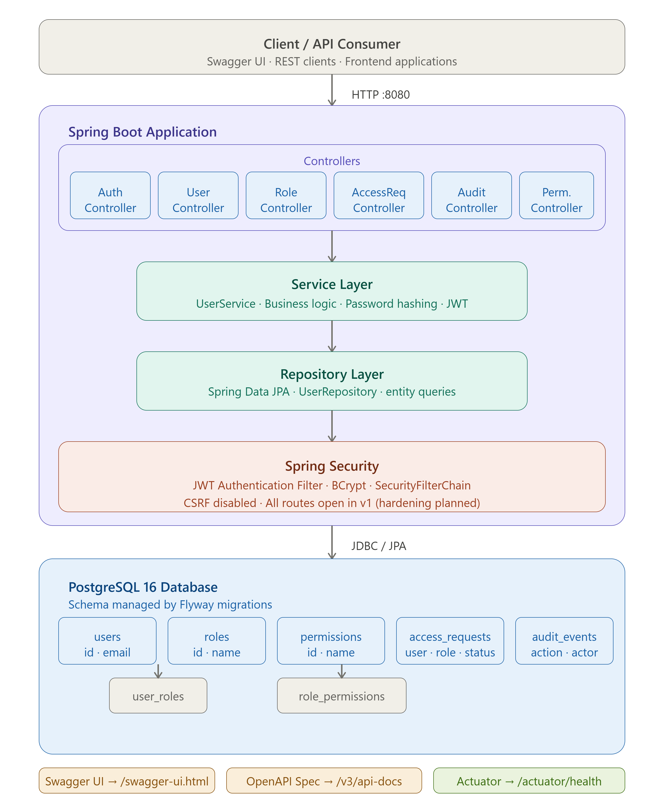
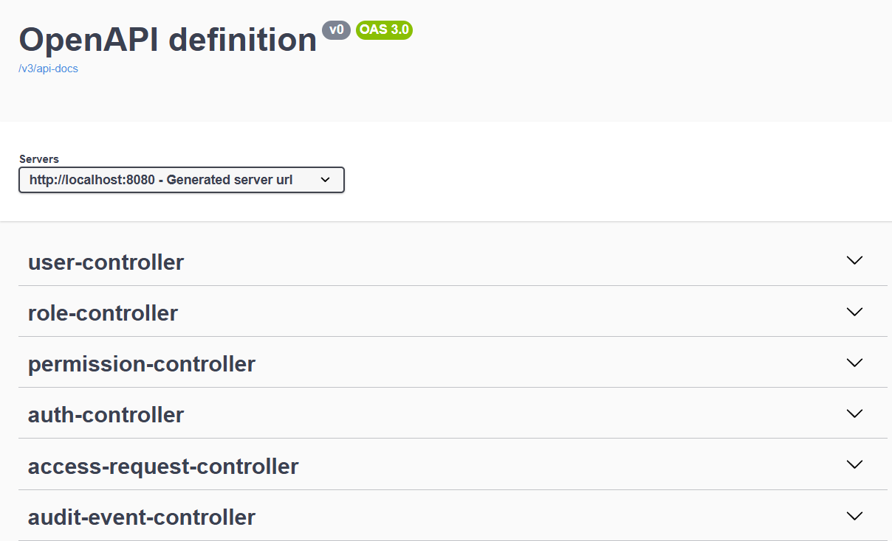
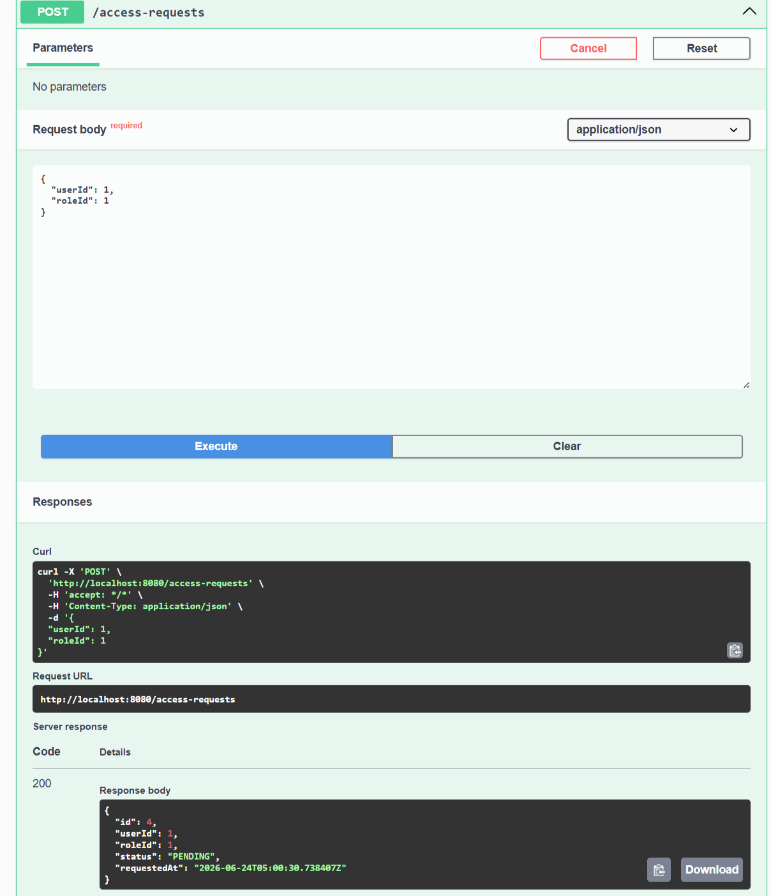
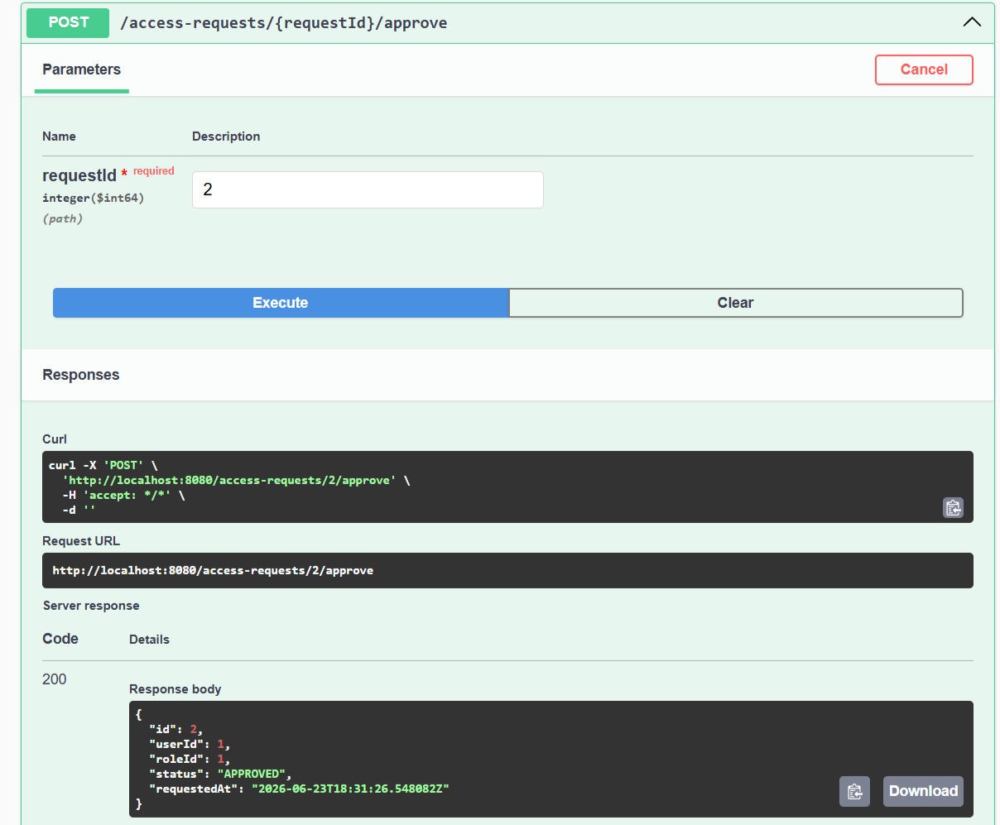
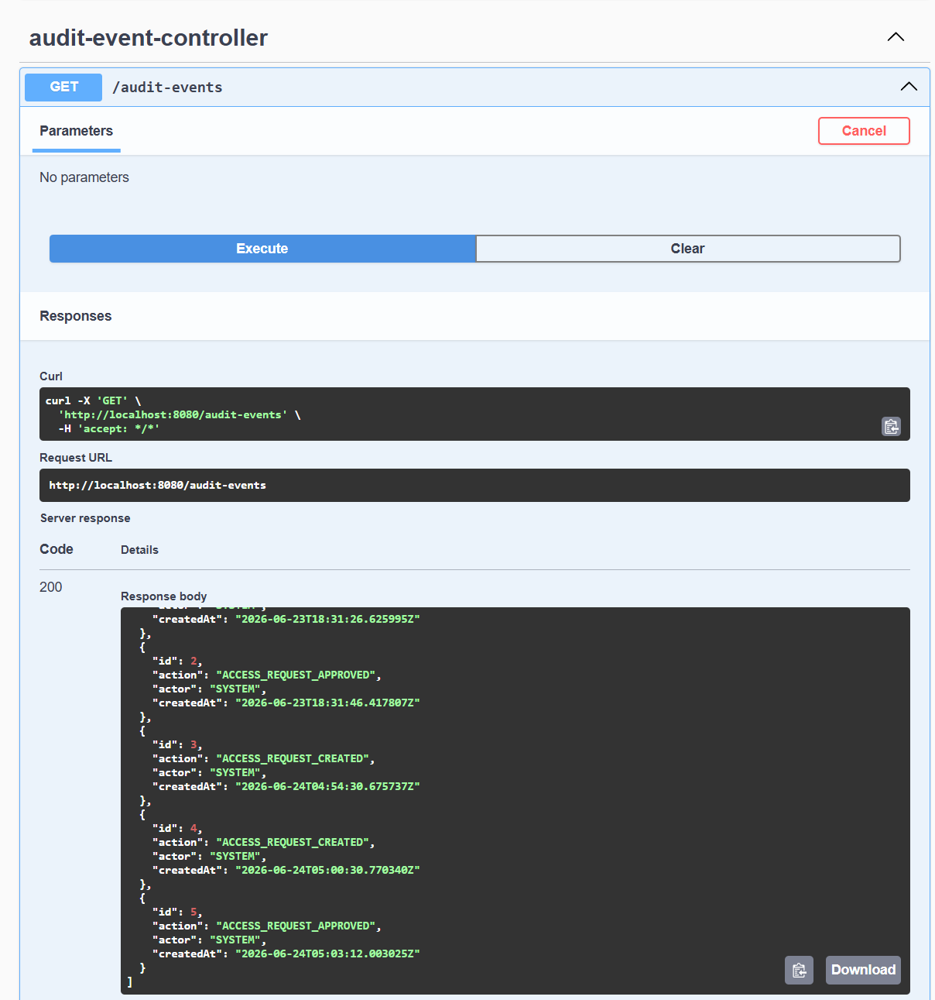

# AccessGuard

AccessGuard is a backend-focused Identity & Access Governance (IAG) platform designed to manage users, roles, permissions, access requests, approval workflows, and audit trails.

The project demonstrates enterprise-grade backend engineering concepts including authentication, authorization, workflow management, auditability, database migrations, REST API design, and secure application architecture.

---

## Architecture



---

## Features

### Authentication & Security
- User Registration
- User Login
- BCrypt Password Hashing
- JWT Token Generation
- JWT Request Validation
- Spring Security Integration

### Identity Management
- User Management
- Role Management
- Permission Management
- User ↔ Role Assignment
- Role ↔ Permission Assignment

### Access Governance
- Access Request Submission
- Access Approval Workflow
- Access Rejection Workflow
- Request Status Tracking

### Audit & Compliance
- Audit Event Logging
- Access Request Audit Trail
- Approval Activity Tracking

### API Documentation
- OpenAPI / Swagger UI
- RESTful API Design
- Interactive API Testing

---

## Tech Stack

| Category | Technology |
|-----------|------------|
| Language | Java 23 |
| Framework | Spring Boot 3.2.5 |
| Security | Spring Security, JWT |
| Database | PostgreSQL 16 |
| ORM | Spring Data JPA (Hibernate) |
| Migration | Flyway |
| Documentation | Swagger / OpenAPI |
| Build Tool | Maven |
| Containerization | Docker |

---

## System Architecture

```text
Client
   │
   ▼
Controllers
   │
   ▼
Services
   │
   ▼
Repositories
   │
   ▼
PostgreSQL
```

The application follows a layered architecture:

- Controllers expose REST APIs.
- Services contain business logic.
- Repositories handle persistence.
- PostgreSQL stores application data.
- Spring Security secures endpoints.
- Flyway manages schema evolution.

---

## API Documentation

Swagger UI



Once the application is running:

```bash
http://localhost:8080/swagger-ui/index.html
```

OpenAPI Specification:

```bash
http://localhost:8080/v3/api-docs
```

---

## Access Governance Workflow

### 1. Create Access Request



---

### 2. Approve Access Request



---

### 3. Audit Event Generation



---

## Database Schema

Core entities:

```text
users
roles
permissions
user_roles
role_permissions
access_requests
audit_events
```

Relationships:

```text
User
 └── Roles

Role
 ├── Users
 └── Permissions

Permission
 └── Roles

Access Request
 ├── User
 └── Role

Audit Event
 └── Workflow Activity
```

---

## Getting Started

### Prerequisites

- Java 23+
- Maven 3.9+
- PostgreSQL 16+
- Git

### Clone Repository

```bash
git clone https://github.com/Ayushblank02/AccessGuard.git
cd AccessGuard
```

### Configure Database

Update:

```properties
src/main/resources/application.properties
```

```properties
spring.datasource.url=jdbc:postgresql://localhost:5432/accessguard
spring.datasource.username=postgres
spring.datasource.password=your_password
```

### Run Application

```bash
mvn spring-boot:run
```

Application starts on:

```bash
http://localhost:8080
```

---

## Current Project Status

### Version 1 (Completed)

- JWT Authentication
- User Management
- Role Management
- Permission Management
- Access Requests
- Approval / Rejection Workflow
- Audit Logging
- Swagger Documentation
- Flyway Migrations
- PostgreSQL Persistence

---

## Future Roadmap

### Version 2 — Temporal Entitlements

Planned features:

- Role Expiration Dates
- Temporary Access Grants
- Automatic Access Revocation
- Expiring Permissions
- Access Lifecycle Tracking

Example:

```text
Developer Role
Valid Until:
31-Dec-2026
```

---

### Version 3 — Access Recertification

Planned features:

- Quarterly Access Reviews
- Manager Certification Campaigns
- Certification Decisions
- Review Dashboards
- Compliance Reporting

Example:

```text
Manager reviews:
✔ Keep Access
✖ Revoke Access
```

---

### Version 4 — Segregation of Duties (SoD)

Planned features:

- SoD Policy Engine
- Conflict Detection
- Risk Analysis
- Approval Overrides
- Compliance Controls

Example:

```text
User cannot have:

PAYMENT_APPROVER
+
PAYMENT_CREATOR
```

---

## Learning Objectives

This project was built to explore:

- Secure Backend Development
- Spring Security
- JWT Authentication
- Identity & Access Management
- REST API Design
- Database Modeling
- PostgreSQL
- Flyway
- Enterprise Software Architecture

---

## Live Demo

- **API Health Check:** https://accessguard-7nv9.onrender.com/
- **Swagger UI:** https://accessguard-7nv9.onrender.com/swagger-ui/index.html

---

## Author

**Ayush Srivastava**

GitHub:
https://github.com/Ayushblank02
